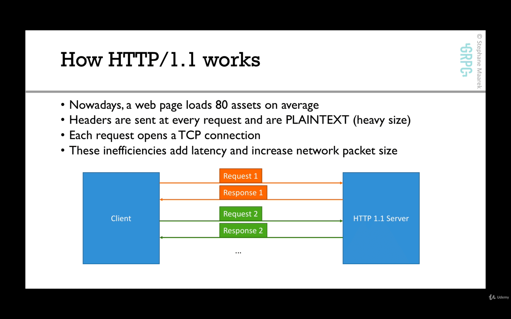
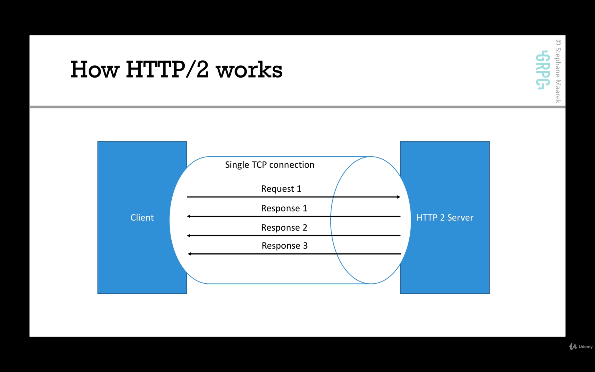

# Section 3. [Theory] gRPC Internals Deep Dive

## 6-1. Protocol Buffers & Language Interoperability
### Protocol buffers role in gRPC

### Efficiency of protocol buffers over JSON
gRPC uses protocol buffers for communications. Some pros of protocol buffers:
- Since protocol buffers are smaller than json, we save in network bandwidth
- parsing JSON is actually CPU intensive(because the format is human readable)
- parsing protocol buffers(binary format) is less CPU intensive because it's closer to how a machine represents data
- by using gRPC, the use of protocol buffers means faster and more efficient communication, friendly with mobile devices that have a
slower CPU

### gRPC Languages
- grpc-java
- grpc-go
- grpc-c
    - c++
    - python
    - ruby
    - objective-c
    - php
    - c#
- other languages implement gRPC natively or rely on C implementation

This means if grpc-C library gets updated, it doesn't mean the java or go library will be updated at the same time, but you can expect c++m, python and ...
libraries to get the updates because they directly depend on it.

### Summary: Why protocol buffers?
- easy to write message definition
- the definition of the API is independent from the implementation
- a huge amount of code can be generated, in any language, from a simple .proto file
- the payload is binary, therefore very efficient to send/ receive on a network and serialize/de-serializer on a CPU
- protocol buffers defines rules to make an API evolve without breaking existing clients, which is helpful for microservices(no more versioning
of API, as long as you follow a few rules)

## 7-2. HTTP2
demo: imagekit.io/demo/http2-vs-http1

### How HTTP/1.1 works
- http 1.1 opens a new TCP connection to a server at each request 
- it doesn't compress headers(which are plaintext)
- it only works with request/response mechanism(no server push)

HTTP was originally composed of two commands:
- GET: to ask for content
- POST: to send content
- over time more added

- Nowadays, a web page loads 80 assets on average
- headers are sent at every request and are plaintext(heavy size). So 80 times you will have to send the same headers, so there will be duplication of data and
a lot of bandwidth is used
- each http 1.1 req opens a TCP connection
- these inefficiencies add latency and increase packet size

So for example a TCP connection for html file with heavy headers, then new TCP connection with the same heavy headers for css file and ... .

### How HTTP/2 works
- published in 2015 by google, but it was battle tested for many years under the name SPDY
- http2 supports multiplexing
  - means the client & server can push messages in parallel over the same TCP connection this reduces latency
- http2 supports server push
  - means server can push streams(multiple messages) for one request from the client. So the client doesn't need to ask for more
  data. It can just wait for server to push data. This saves **round trips(latency)**
- http2 supports header compression
  - headers(text based) can now be compressed
  - so these have much less impact on the packet size(note: headers have impact on packet size)
  - remember the average http req may have over 20 headers, due to cookies, content cache and application headers
- http2 is binary
  - while http/1 text makes it easy for debugging, it's not efficient to transfer dat over the network
  - protocol buffers is a binary protocol and makes it a great match for http2(any binary protocol is a great match for http2)
- http2 is secure(SSL is not required but recommended by default. but if you use a browser to access a website on http2, the ssl is required)

HTTP2: bottom line
- less chater
- more efficient protocol(less bandwidth)
- reduced latency
- increased security
- and you get all these improvements out of the box by using gRPC framework

## 8-3. 4 Types of gRPC APIs

## 9-4. Scalability in gRPC

## 10-5. Security in gRPC (SSL)

## 11-6. gRPC vs REST

## 12-7. Section Summary - why use gRPC