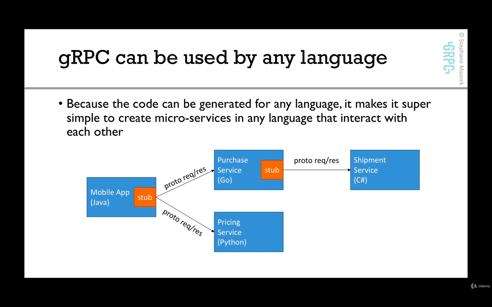

# Section 9. [Hands-On] gRPC Advanced Features Deep Dive

## 37-1. [Theory] Errors in gRPC
### Error codes
- in http(REST APIs are built on top of them), there are many error codes
- while http codes are standardized they're not usually clear and people misuse them

- gRPC approach is instead of so many error codes, there are just a few error codes.
- there is also a complete reference to implementation of error codes that close a lot of gaps with documentation: https://avi.im/grpc-errors
- if an app needs to return extra information on top of an error code, it can use the metadata context

## 38-2. [Hands-On] Errors implementation
- Let's implement an error message for a new `SquareRoot` unary API
- create `SquareRoot` RPC
- implement the server with the error handling
- implement the client with the error handling

One thing you wanna do usually when you can have errors in an rpc, is document the kind of errors that will be in that rpc.
You can add the docs in proto file's rpc definition.

We use `google.golang.org/grpc/status` to send errors and `google.golang.org/grpc/codes` to specify the actual error codes.

## 39-3. [Theory] Deadlines
- deadlines allow gRPC client to specify how long they are willing to wait for an RPC to complete before the RPC is terminated with the error
`DEADLINE_EXCEEDED`
- The gRPC documentation recommends you set a deadline for all client RPC calls
- setting the deadline is up to you: how long do you feel your API should have to complete?
- the server should check if the deadline has exceeded and cancel the work it is doing
- Note: deadlines are propagated across if gRPC calls are chained. That means that if client A calls gRPC server B which calls gRPC server C, then the
deadline is passed all along. So the RPC will be chained across all your microservices and they all are aware of the deadline to make sure that they
don't exceed it

Deadlines Doc : https://grpc.io/blog/deadlines

## 40-4. [Hands-On] Deadlines
- we'll create a call `GreetWithDeadline` RPC call
- the server will check periodically if the client has cancelled the req

## 41-5. [Theory] SSL Security
### SSL encryption in gRPC
- in production, gRPC calls should be running with encryption enabled(this is default for HTTP2 so gRPC respects that)
- to encrypt calls, we need to generate SSL certificates
- SSL allows communication to be secure end-to-end and ensuring no man in the middle attack can be performed

### The need for SSL encryption(Why do we need encryption)
- when you communicate over the internet, your data is visible by all the servers that transfer your packet. Any router on the internet,
  can intercept the req payload and ... .
- any router in the middle can view the packets you're sending using **plain text**
- it's not secure enough when the data is sensitive

What we can do when the data is sensitive?
SSL allows clients and servers to encrypt data.

Let's say we have SSL and a gRPC client talking to gRPC server. First the payload will be encrypted using SSL. Now, no one can decrypt it except
the gRPC server. When server receives it, it will do SSL encryption and gets the payload.


- SSL enables clients and servers to securely exchange data
- routers cannot view the content of the internet packets(because they will only see the encrypted data and they can't decrypt it)

### What is SSL?
- TLS(transport layer security), successor of SSL, encrypts the connection between 2 endpoints for secure data exchange
- there are two ways of using SSL(gRPC can use both):
  - one-way verification, e.g. browser => web server (encryption)
  - two-way verification, e.g. authentication (authentication)

In this course, we will only see encryption.

### Detailed setup of SSL for encryption
1. setup the certificates. For this, we need to create a certificate authority(CA). A CA can be public, if you want to sign public url. Or you can
   have a private CA, if for example you have internal URLs. In this case, you need to create and maintain that CA.
2. the server needs to create a private key. Using that private key, it will generate a certificate request and it will ask the CA: Hey please sign
   my certificate request, I want to prove that I am `<url that we want to encrypt like myapi.example.com>`.
3. the CA looks at the certificate req and says: Ok I'm gonna sign it for you. And it sends back the signed certificates.
4. the server receives the server CRT which is the certificate that was signed by the CA(so on the server side, we need to have a private key
   and the signed certificates)
5. on the client side, we need to have the trust certificate from the CA. For this, the CA usually issues a **CA root public certificate** and that
   public certificate is what the client needs to trust
6. now the client and server should be able to do a SSL handshake
7. during the SSL handshake, the server will send to the client, the signed SSL certificate
8. the gRPC client will verify the SSL certificate from the server
9. once the verification on the client is done, there will be a secure SSL communication between the client and server

In gRPC, the SSL handshake is done by gRPC itself.


## 42-6. [Hands-On] SSL Security
Code Samples for Security: https://grpc.io/docs/guides/auth.html

### Hands on SSL encryption in gRPC[golang]
- we'll create(setup) a certificate authority
- setup a server certificate
- sign a server certificate
- setup the server to use TLS encryption
- setup the client to connect securely over TLS

https://github.com/grpc/grpc-go/blob/master/Documentation/grpc-auth-support.md

https://grpc.io/guides/auth.html

Note about `ssl>instructions.sh`:

- You shouldn't share `server.crt` with anyone!
- `SERVER_CN` is the server's certificate name, it would be sth like: myapi.example.com (whatever address your gRPC api will be at)
- After the `SERVER_CN=localhost` commands, `cd` into the `ssl` directory.

After generating the server.csr , you would send it by email to whoever has the CA and then, they will run this command to sign it(they will
sign it for for example 365 days):
```shell
openssl x509 -req -passin pass:1111 -days 3650 -in server.csr -CA ca.crt -CAkey ca.key -set_serial 01 -out server.crt -extensions req_ext -extfile ssl.cnf
```

When we have an SSL error, like the server is SSL enabled but the client is using `grpc.withInsecure()`, the error would be sth like:
`rpc error: code = Unavailable desc = all SubConns are in TransientFailure, latest connection error: <nil>`

On client, you need to use:
```go
creds, err := credentials.NewClientTLSFromFile(certFile, "")
// error handling
grpc.WithTransportCredentials(creds)
```

Note: You can run the client in both insecure and secure(SSL enabled) modes based on some condition, if the server also is running 
in the same mode(see the example code). Now you can have the server and client switch TLS on and off.

## 43-7. [Demo] Language Interoperability


You can run the grpc server written in go and then a java client sending reqs to server and everything works out(as long as the protobuf definitions
are the same)! The opposite is also true(java server and go client).

## 44-8. gRPC Reflection & Evans CLI
- as we've seen, for clients to connect to our server, they need to have a .proto file(to produce code for the selected language) which defines the server.
Both the server and the client have the same proto file
- this is fine for production(you definitely want to know the API definition in advance)
- for development, when you have a gRPC server you don't know what it's capable of doing, sometimes you wish you could ask the server: "Hey! What APIs
do you have?"

Enter gRPC reflection.

We can ask the server what APIs it has.

We may want reflection for two reasons:
- we want the servers to expose which endpoints are available which is a huge difference to for example a REST api where we don't know in advance which
API endpoints exist
- it will allow us to use CLI interfaces that do support reflection, to talk to our server without having a preliminary .proto file

To use reflection:
1. implement reflection on our server
2. we'll use the evans CLI(which OFC supports reflection) to practice on the client side

In grpc-go repo, go to reflection directory to see the instructions. On server, we'll use `google.golang.org/grpc/reflection` to enable reflection:
```go
s := grpc.NewServer()
reflection.Register(s)
```

Now install Evans cli:
```shell
go get github.com/ktr0731/evans
```

Then:
```shell
evans -p <server port> -r

show package

show service

show message

desc <message type> # like desc SumRequest
```

Working with the packages:
```shell
show package # gives you some packages like `default`
package <package name like default> # with this, we say we want to use package <package name>
```

```shell
service <service name like CalculatorService> # now we're in default.CalculatorService@<host:port> . Now we can call the RPC functions in this service
call <rpc function in this service> # call sum. Then it will prompt us for the body of the req
```

When you have an RPC that is client streaming(in our project like `call ComputeAverage`), the cli will never stop asking req of 
the body until we hit `ctrl + d` which will send the signal to server saying: we're done streaming and then we will get the single server response.

Note: This wasn't possible if we didn't enable gRPC reflection on the server.